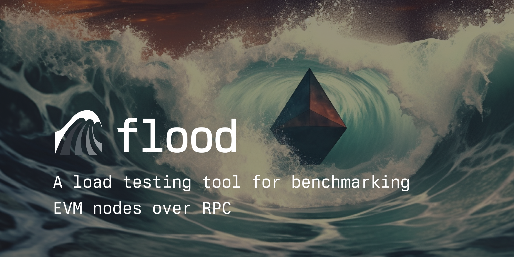

# <h1 align="center"> 🌊🌊 flood 🌊🌊 </h1>

**`flood` is a load testing tool for benchmarking EVM nodes over RPC**



[][gh-ci]
[][gh-docker]
[![Telegram Chat][tg-badge]][tg-url]

[gh-ci]: https://github.com/paradigmxyz/flood/actions/workflows/ci.yml
[gh-docker]: https://github.com/paradigmxyz/flood/actions/workflows/docker.yml
[tg-badge]: https://img.shields.io/endpoint?color=neon&logo=telegram&label=chat&url=https%3A%2F%2Ftg.sumanjay.workers.dev%2Fparadigm%5Fflood
[tg-url]: https://t.me/paradigm_flood

For each RPC method, `flood` measures how load affects metrics such as:
1. throughput
2. latency (mean, P50, P90, P95, P99, max)
3. error rate

`flood` makes it easy to compare the performance of:
- different node clients (e.g. geth vs erigon vs reth)
- different hardware/software configurations (e.g. local vs cloud vs low memory vs RAID-0)
- different RPC providers (e.g. Alchemy vs Quicknode vs Infura)

`flood` can generate tables, figures, and reports for easy sharing of results (example report [here](https://datasets.paradigm.xyz/notebooks/flood/example_report.html))

## Contents
1. ### [Installation](#installation)
    1. [Prerequisites](#prerequisites)
    2. [Installing Flood](#installing-flood)
    3. [Docker](#docker)
2. ### [Usage Guide](#usage-guide)
    1. [Basic Load Tests](#basic-load-tests)
    2. [Remote Load Tests](#remote-load-tests)
    3. [Printing Test Results](#printing-test-results)
    4. [Report Generation](#report-generation)
    5. [Differential Tests](#differential-tests)
    6. [From Python](#from-python)
    7. [Performing Deep Checks](#performing-deep-checks)
3. ### [Contributing](#contributing)


## Installation

#### Prerequisites

Install [`vegeta`](https://github.com/tsenart/vegeta):
- on mac: `brew update && brew install vegeta`
- on linux: `go install github.com/tsenart/vegeta/v12@v12.8.4`

After installation, make sure `vegeta` is on your `$PATH`. Running `vegeta -h` should output a path. If it does not, you probably have not set up `go` to install items to your `$PATH`. You may need to add something like `export PATH=$PATH:~/go/bin/` to your terminal config file (e.g. `~/.profile`).

`flood` also requires `python >= 3.7`

#### Installing `flood`

```
pip install paradigm-flood
```

Typing `flood help` in your terminal should show help output. If it does not, you probably have not set up `pip` to install items to your `$PATH`. You may need to add something like `export PATH=$PATH:~/.local/bin` to your terminal config file (e.g. `~/.profile`). Alternatively, you can avoid setting up your `$PATH` and just type `python3 -m flood` instead of `flood`.

#### Docker

Alternatively, flood can be used as a [Docker image](https://github.com/paradigmxyz/flood/pkgs/container/flood).

## Usage guide

`flood` works by bombarding an RPC endpoint with different patterns of RPC calls. Measurements of the RPC endpoint's performance under different controlled loads are then used to paint a detailed view of the node's performance.

Every time flood runs, it saves its parameters and test results to an output directory. You can specify this output directory with the `--output` parameter, otherwise a temporary directory will be created. Running a test will populate the folder with the following files:
- `figures/`: directory containing PNG's summarizing node performance
- `results.json`: results of the test including performance metrics
- `summary.txt`: printed summary of test that was output to the console
- `test.json`: metadata and parameters used to create and run the test

### Basic load tests

Here is an example of a basic test with `flood`. It will benchmark block retrieval from two different nodes. It will test at 3 different rates (10, 100, and 1000 requests per second) and it will test them for 30 seconds each.

`flood eth_getBlockByNumber NODE1_NAME=NODE1_URL NODE2_NAME=NODE2_URL --rates 10 100 1000 --duration 30`

To see all of the parameters available for controlling `flood` tests use `flood --help`

### Remote load tests

Instead of broadcasting RPC calls from whatever machine running the `flood` CLI command, `flood` can broadcast the calls from a remote process on a remote machine. In particular, `flood` can broadcast the calls from the same machine that is running the EVM node in order to eliminate any noise or bottlenecks associated with networking.

This can be accomplished by installing flood on the remote machine and then providing `flood` with login credentials and routing details using the following syntax:

`flood <test> [node_name=][username@]hostname:[test_url] ...`

For example, the following command will test a reth node and an erigon node remotely:

`flood eth_call reth=ubuntu@92.92.92.92:localhost:8545 erigon=ubuntu@91.91.91.91:localhost:8545`

If there are multiple remote tests, these tests will be run in parallel. After the tests are complete, `flood` will retrieve the results and summarize using the same methodology as a local test.

### Printing test results

By default `flood` produces verbose output of each test as it runs. This can be disabled with the `--quiet` parameter. To re-print the results of an old test, use `flood print <TEST_DIR>`. To print a summary of multiple tests, use `flood print <test_1_dir> <test_2_dir>`.

### Report generation

After running tests, you can generate an HTML + Jupyter report similar to [this] one. This is done by running `flood report <TEST_DIR>`. Multiple tests can be combined into one report with `flood repos <TEST_DIR_1> <TEST_DIR_2> ...`.

### Differential tests

Instead of testing the raw performance of an RPC node, `flood` can be used to test the correctness of a node's responses using a differential testing approach. This works by using two nodes and making sure that their responses match under a variety of RPC calls. This is done using the `--equality` parameter. For example:

`flood all reth=91.91.91.91 erigon=92.92.92.92 --equality`

### From python

All of `flood`'s functionality can be used from python instead of the CLI. Some functions:

|description|python|
|-|-|
|Import flood|`import flood`|
|Run tests|`flood.run(...)`|
|Load the parameters of a test|`flood.load_single_run_results_payload(output_dir)`|
|Load the results of a test|`flood.load_single_run_results_payload(output_dir)`|
|Run a live version of a results notebook|`jupyter notebook <TEST_DIR>`|

### Performing deep checks

Under normal operation `flood` relies on vegeta to compute performance summaries of each test. This works well, but sometimes it is desirable to implement custom introspection not available in `vegeta`.

In particular, `vegeta` counts any status-200 response as a success, even if the contents of the response is an RPC error. Running with the `--deep-check` command will check every response to make sure that it returns well-formed JSON with no RPC errors. With `--deep-check`, `flood` also computes separate performance statistics successful vs failed calls.

If you want to save the timing information and raw contents of every single response from the test to the `results.json` output, use the `--save-raw-output` argument. This allows for performing own custom analyses on the raw data.

## Contributing

Contributions are welcome in the form of issues, PR's, and commentary. Check out the contributor guide in [CONTRIBUTING.md](CONTRIBUTING.md).

